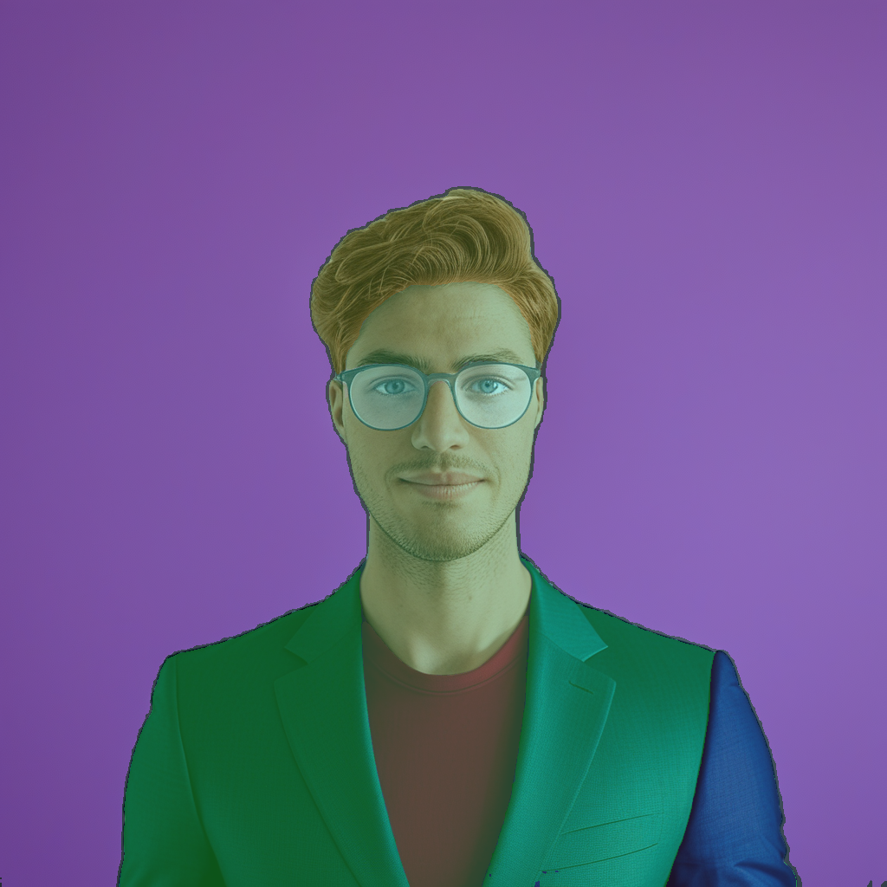
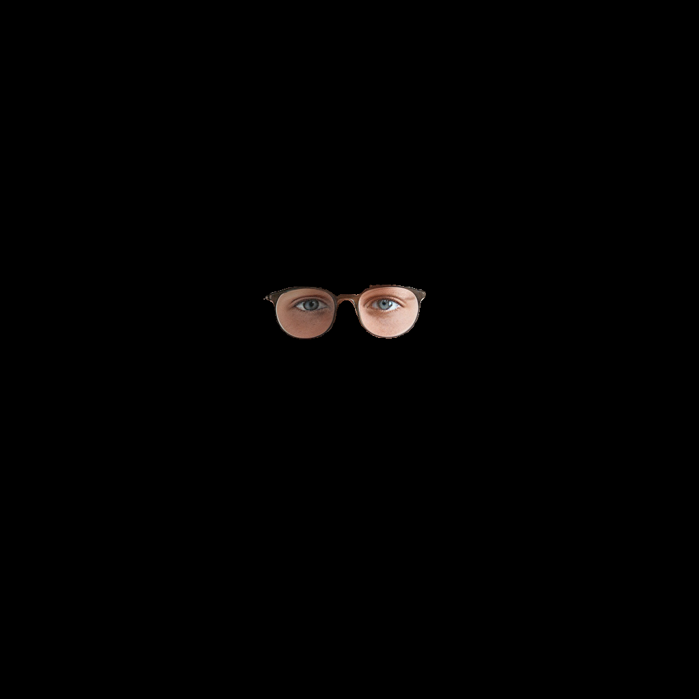

# 🧠 CLIP-SAM Guided Image Segmentation

A hybrid visual understanding pipeline combining **Meta AI's Segment Anything (SAM)** and **OpenAI's CLIP** to perform **semantic segmentation** from natural language prompts.

This project allows users to extract semantically meaningful parts of an image (e.g., "eyes and glasses") by ranking SAM-generated masks based on their similarity to a CLIP-encoded text prompt.

---

## 🎯 Segmentation Output Example

Below is an example of the input image, the automatically generated masks, and the final output filtered by the referral prompt:

Prompt: "eyes and glasses"

<p align="center">    </p>

## 🚀 Features

* 🖼️ **Zero-shot segmentation** using natural language (no labeled training data needed)
* 🤖 **Integration of SAM and CLIP** for smart visual masking
* 🎯 **Cosine similarity ranking** of image regions w\.r.t. text
* 📊 **Softmax-based filtering** to select most relevant masks
* 📸 Saves final segmented image and overlay of all SAM masks

---

## 🧠 Model Architecture Overview

This project leverages two powerful pretrained vision models to perform **zero-shot image segmentation via natural language**:

### 🔹 1. **Segment Anything Model (SAM)** – Meta AI

<p align="center">  </p>

* **Architecture:** Vision Transformer (ViT-B)
* **Role:** Generates high-quality masks covering all prominent objects in the image.
* **Output:** Binary masks with bounding boxes and confidence scores.
* **Checkpoint Used:** `sam_vit_b_01ec64.pth`

SAM excels at proposing a wide variety of possible segments in an image, regardless of class labels. It enables universal segmentation across object boundaries with high generality.

---

### 🔹 2. **CLIP (Contrastive Language-Image Pretraining)** – OpenAI

<p align="center">  </p>

* **Architecture:** Vision Transformer (ViT-B/32)
* **Role:** Ranks image segments based on similarity to the text prompt.
* **Checkpoint Used:** Custom local `.pt` file from `ViT-B-32` backbone.

CLIP enables **zero-shot understanding** of visual features by aligning them with natural language. Each SAM-generated segment is cropped, preprocessed, and compared to the user prompt using cosine similarity in the joint embedding space.

---

### 🔧 Processing Pipeline Summary

1. **Input Image →** Preprocessed with OpenCV
2. **SAM →** Generates segment proposals (`N` binary masks)
3. **CLIP →** Embeds each segment and the text prompt
4. **Scoring →** Cosine similarity between image/text embeddings
5. **Selection →** Masks above threshold are combined into final output

---

## 📂 Project Structure

```bash
├── models/
│   ├── OpenAI-CLIP-ViT-Base-32.pt
│   └── MetaAI-SAM-ViT-Base-01ec64.pth
├── images/
│   └── Image - 01.png
├── output/
│   ├── referral_segmented_output.png
│   └── all_generated_masks.png
├── segment_clip_sam.py  # ← Main script
└── README.md
```

---

## 🧪 Setup

### 1. Clone & Environment

```bash
git clone https://github.com/MehranBazrafkan/referral-image-segmentation.git
cd referral-image-segmentation

python -m venv venv
source venv/bin/activate  # or venv\Scripts\activate on Windows
pip install -r requirements.txt
```

### 2. Download Models

Place the following models in the `./models/` folder:

* **CLIP ViT-B/32 (OpenAI)**:

  * Download from: [https://github.com/mlfoundations/open\_clip](https://github.com/mlfoundations/open_clip)
* **SAM ViT-B (Meta)**:

  * Download from: [https://github.com/facebookresearch/segment-anything](https://github.com/facebookresearch/segment-anything)

---

## 🛠️ Usage

### Basic Command

```bash
python segment_clip_sam.py
```

### Parameters (inside script)

* `input_image_path`: Path to input PNG/JPG image
* `user_prompt`: Natural language prompt (e.g. `"eyes and glasses"`)
* `similarity_threshold`: Float threshold to filter top masks

---

## 📥 Output

* `referral_segmented_output.png`: Image with only relevant segments (based on prompt)
* `all_generated_masks.png`: Visual overlay of all SAM-generated masks

---

## 📌 Dependencies

* Python 3.8+
* `torch` (CUDA optional)
* `opencv-python`
* `numpy`
* `Pillow`
* `open-clip-torch`
* `segment-anything`
* `tqdm`

Install with:

```bash
pip install -r requirements.txt
```

---

## 📚 Credits

* **[Segment Anything (SAM)](https://github.com/facebookresearch/segment-anything)** by Meta AI
* **[CLIP](https://github.com/openai/CLIP)** by OpenAI
* **[open\_clip](https://github.com/mlfoundations/open_clip)** by LAION

---

## 🧠 Future Plans

* Multi-prompt attention fusion
* Interactive mask selector GUI
* Batch processing with prompts per image
* Video frame segmentation support

---

## License

This project is licensed under a **custom proprietary license**. You are only permitted to read the code for educational purposes.  
**Commercial, derivative, or production use is strictly prohibited.**  
See the [LICENSE](./LICENSE) file for full details.
